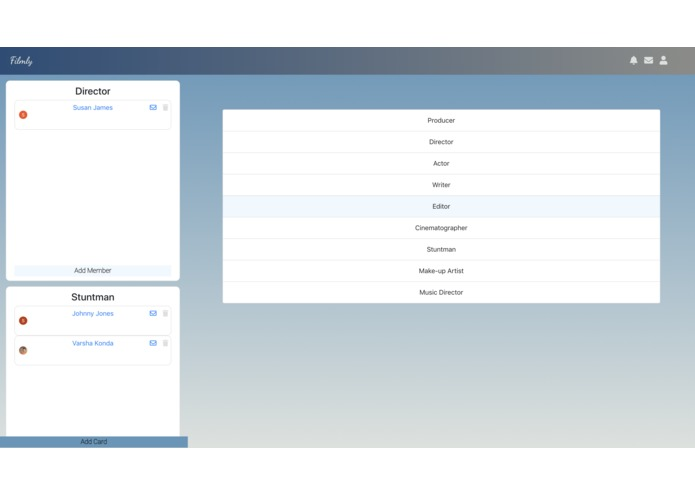
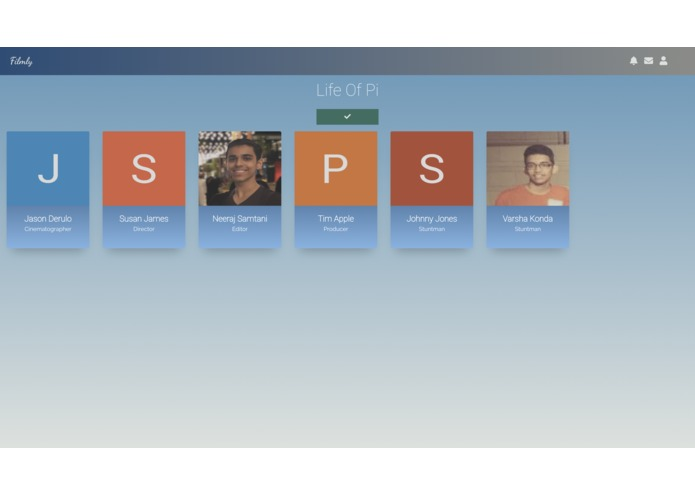
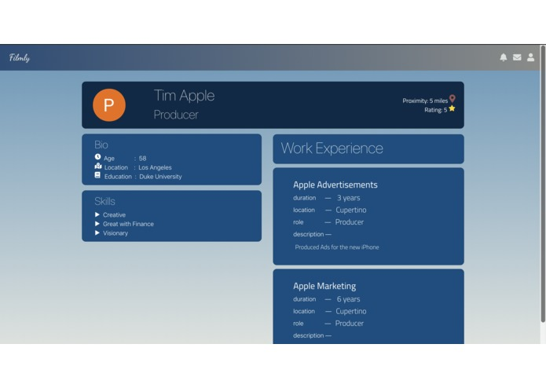

# Filmly

## Inspiration
Being in the heart of Hollywood, filmmaking runs in the veins of the LA community. However, breaking into such a competitive industry remains an unachievable dream for many, and our team wanted to help change that. To tackle this problem we created Filmly - a web app which fosters community and communication between rising filmmakers from all social backgrounds, in an attempt to help them gain more exposure and gradually pave their way into the budding film industry! Skilled Cinematographer? Creative Writer? Rich Producer? You've come to the right place to expedite your journey in Hollywood!

## What it does
Filmly lets aspiring filmmakers create a profile on our website in order to portray their skills and interests. In order to facilitate collaboration on projects, the application then lets the user join a network of suitable peers. The platform enables filmmakers to connect with each other to form crews, thereby building their portfolios, and participating in the larger community of Los Angeles.

## Screenshots

### Team Builder

### Team Details Page

### User Profile Page

## How we built it
Filmly was developed using React and Firebase. It is a multi-page application built with mobile responsiveness. For the backend, we employed a Google Cloud Firebase Realtime Database built with a personally designed schema. We also integrated APIs such as the ZipCode API to match users of the app based on location information.

## What's next for Filmly
Since Filmly is the quintessential web app for aspiring filmmakers, our team hopes to add many features including in-app messaging, recommended resources, upcoming events in LA, and a forum for filmmakers to discuss their ideas. We aim to make Filmly the one-stop destination for enthusiastic filmmakers, ensuring that everyone gets a fair shot at rising to fame.